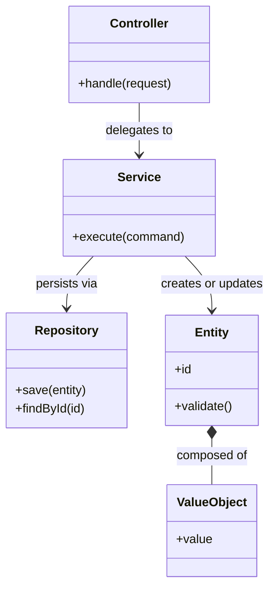
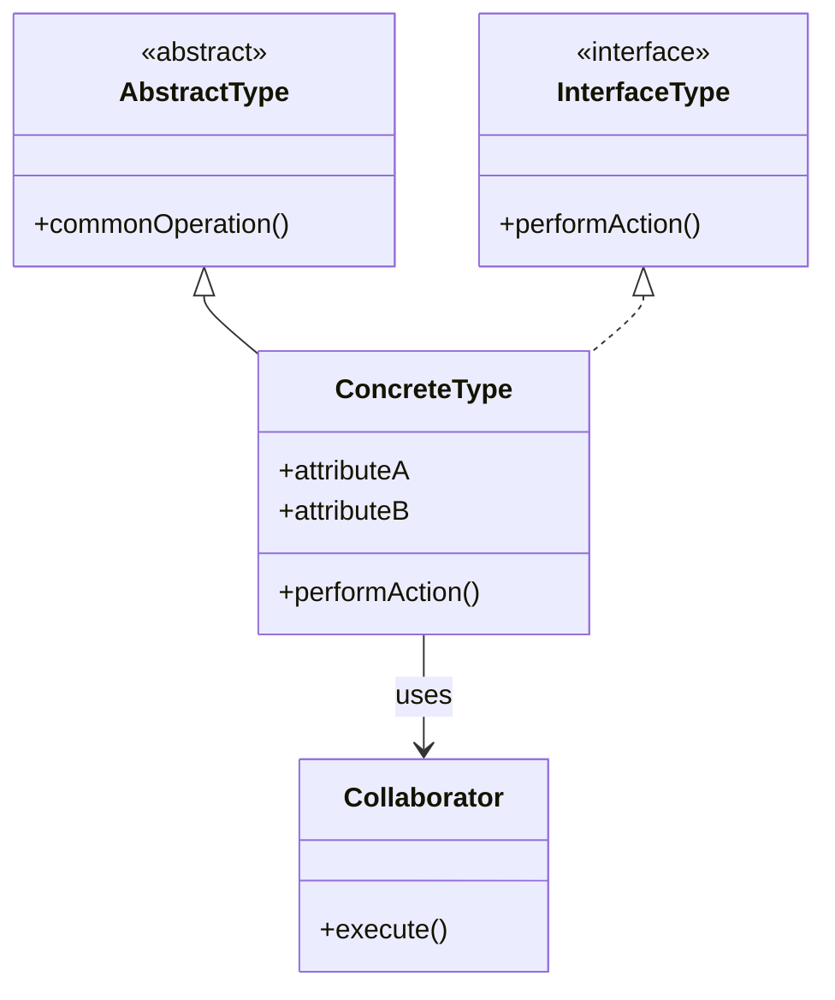
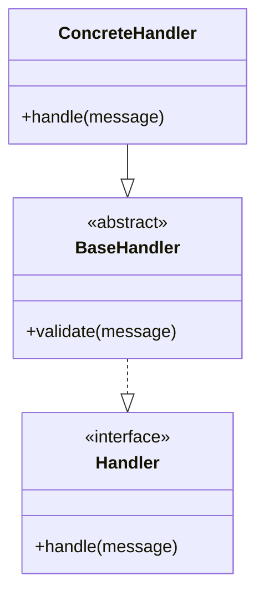
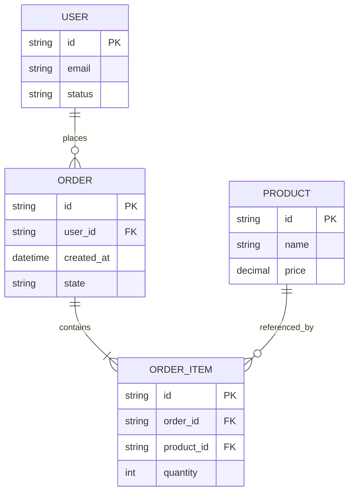

# Class Diagrams

> Describe the static structure of the system with Mermaid `classDiagram` and, where useful, `erDiagram`.
>
> Capture the most important classes, interfaces, abstract types, entities, attributes, methods, and relationships. Leave runtime flow to system components and use cases.

## Document Control

| Field | Value |
|---|---|
| System Name | {{system_name}} |
| Status | Draft / Reviewed / Approved |
| Version | {{document_version}} |
| Owner | {{owner_or_team}} |
| Last Updated | {{yyyy-mm-dd}} |
| Source of Truth | {{primary_spec_or_repo_path}} |
| Related Docs | {{system_components_doc}}, {{use_cases_doc}}, {{ui_ux_doc}}, {{adr_doc}} |

## 1. Purpose and Scope

**Purpose**  
{{What structural area this document explains and why it matters.}}

**In Scope**
- {{bounded context, module, domain, or aggregate}}
- {{bounded context, module, domain, or aggregate}}

**Out of Scope**
- {{excluded area}}
- {{excluded area}}

## 2. Modeling Rules

| Topic | Guidance |
|---|---|
| Naming | {{class, interface, abstract, entity, DTO, value object naming}} |
| Relationship Types | {{inheritance, composition, aggregation, association, dependency usage rules}} |
| Include | {{identity, invariants, critical attributes, important methods, ownership}} |
| Exclude | {{boilerplate, trivial plumbing, low-value framework details}} |
| Diagram Size | Split diagrams when they stop being readable. |

## 3. Structural Summary

| Topic | Summary |
|---|---|
| Primary Layers / Modules | {{layers or bounded contexts}} |
| Core Abstractions | {{entities, services, repositories, handlers, policies}} |
| Dominant Patterns | {{DDD, layered, hexagonal, CRUD, event-driven, CQRS}} |
| Important Relationships | {{inheritance, composition, ownership, contracts}} |

## 4. High-Level Class Diagram

## 5. Module or Package Breakdown

| Module / Package | Responsibility | Key Types | Depends On |
|---|---|---|---|
| {{module_name}} | {{responsibility}} | {{key types}} | {{dependencies}} |
| {{module_name}} | {{responsibility}} | {{key types}} | {{dependencies}} |
| {{module_name}} | {{responsibility}} | {{key types}} | {{dependencies}} |

## 6. Detailed Diagram Template

### {{subsystem_or_domain_name}}

**Purpose**  
{{What this structural area is responsible for.}}

**Design Notes**
- {{important modeling note}}
- {{important modeling note}}

| Type | Kind | Responsibility | Important Attributes | Important Methods | Notes |
|---|---|---|---|---|---|
| {{type_name}} | Class / Interface / Abstract / Enum / Value Object | {{responsibility}} | {{attributes}} | {{methods}} | {{notes}} |
| {{type_name}} | Class / Interface / Abstract / Enum / Value Object | {{responsibility}} | {{attributes}} | {{methods}} | {{notes}} |

**Relationship Notes**
- {{relationship and why it exists}}
- {{relationship and why it exists}}

## 7. Type Catalog

| Type Name | Kind | Layer / Module | Responsibility | Collaborators | Lifecycle / Ownership |
|---|---|---|---|---|---|
| {{type_name}} | {{class/interface/entity/value object/DTO/enum}} | {{layer_or_module}} | {{responsibility}} | {{related types}} | {{ownership or lifecycle}} |
| {{type_name}} | {{class/interface/entity/value object/DTO/enum}} | {{layer_or_module}} | {{responsibility}} | {{related types}} | {{ownership or lifecycle}} |
| {{type_name}} | {{class/interface/entity/value object/DTO/enum}} | {{layer_or_module}} | {{responsibility}} | {{related types}} | {{ownership or lifecycle}} |

## 8. Contracts and Extension Points

| Type | Kind | Implemented By / Extended By | Responsibility | Stability | Notes |
|---|---|---|---|---|---|
| {{type_name}} | Interface / Abstract Class | {{implementations}} | {{responsibility}} | Stable / Evolving / Experimental | {{notes}} |
| {{type_name}} | Interface / Abstract Class | {{implementations}} | {{responsibility}} | Stable / Evolving / Experimental | {{notes}} |

## 9. ERD Section

**Use when database or persistence structure is architecturally important.**

| Entity | Responsibility | Primary Key | Important Foreign Keys | Constraints | Notes |
|---|---|---|---|---|---|
| {{entity_name}} | {{responsibility}} | {{pk}} | {{fks}} | {{constraints}} | {{notes}} |
| {{entity_name}} | {{responsibility}} | {{pk}} | {{fks}} | {{constraints}} | {{notes}} |

## 10. Invariants, Tradeoffs, and Maintenance

**Invariants / Rules**
- {{rule that must remain true}}
- {{rule that must remain true}}

**Design Decisions / Tradeoffs**
- {{decision, why it exists, and impact}}
- {{decision, why it exists, and impact}}

**Open Questions**
- {{unresolved question}}
- {{unresolved question}}

**Update This Document When**
- Core types, contracts, ownership boundaries, or aggregate rules change.
- The persistence model materially changes architectural understanding.
- A new abstraction becomes central to the design.