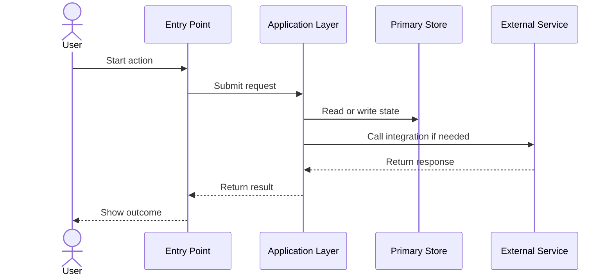
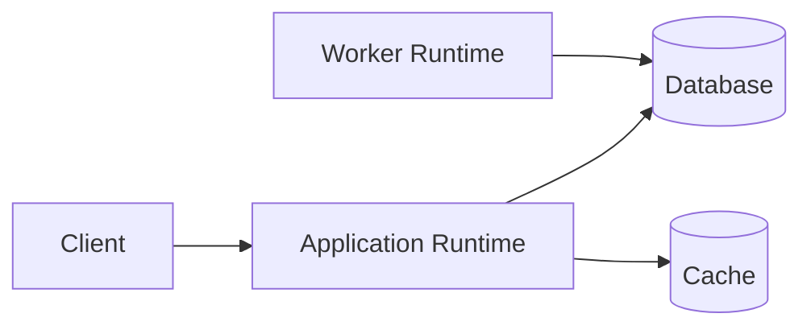

# System Components

> High-level architecture for the system. Capture major components, responsibilities, interactions, data ownership, runtime boundaries, and external dependencies.
>
> Prefer Mermaid for diagrams. Keep this document above class-level detail and below product/README-level simplification.

## Document Control

| Field | Value |
|---|---|
| System Name | {{system_name}} |
| Status | Draft / Reviewed / Approved |
| Version | {{document_version}} |
| Owner | {{owner_or_team}} |
| Last Updated | {{yyyy-mm-dd}} |
| Source of Truth | {{primary_spec_or_repo_path}} |
| Related Docs | {{use_cases_doc}}, {{class_diagrams_doc}}, {{ui_ux_doc}}, {{adr_doc}} |

## 1. Purpose and Scope

**Purpose**  
{{What the system does, why this document exists, and who should read it.}}

**In Scope**
- {{major capability or bounded area}}
- {{major capability or bounded area}}

**Out of Scope**
- {{excluded area}}
- {{excluded area}}

## 2. Architecture Summary

| Topic | Summary |
|---|---|
| Architectural Style | {{layered, modular monolith, event-driven, microservices, plugin-based, etc.}} |
| Primary Actors | {{users, admins, systems, schedulers}} |
| Entry Points | {{UI, API, CLI, webhook, queue consumer, scheduled job}} |
| Primary Stores | {{database, cache, object store, event log}} |
| Key Integrations | {{external systems or services}} |
| Critical Flows | {{top 2-3 flows that define the architecture}} |

## 3. System Context

```mermaid
flowchart LR
    User[Primary User]
    Admin[Administrator]
    ExtA[External System A]
    ExtB[External System B]

    subgraph System[{{system_name}}]
        UI[Presentation Layer]
        App[Application Layer]
        Worker[Background Worker]
        Data[(Primary Store)]
    end

    User --> UI
    Admin --> UI
    UI --> App
    App --> Data
    App --> ExtA
    Worker --> Data
    Worker --> ExtB
```

**Context Notes**
- System boundary: {{what is inside vs outside}}
- Trust boundaries: {{where auth, tenancy, or secrets boundaries exist}}
- External dependencies: {{which integrations are required vs optional}}

## 4. Component Inventory

| Component | Type | Responsibility | Inputs | Outputs | Depends On |
|---|---|---|---|---|---|
| {{component_name}} | UI / Service / Worker / Store / Integration | {{primary responsibility}} | {{inputs}} | {{outputs}} | {{dependencies}} |
| {{component_name}} | UI / Service / Worker / Store / Integration | {{primary responsibility}} | {{inputs}} | {{outputs}} | {{dependencies}} |
| {{component_name}} | UI / Service / Worker / Store / Integration | {{primary responsibility}} | {{inputs}} | {{outputs}} | {{dependencies}} |

## 5. Internal Component Diagram

```mermaid
flowchart TB
    Client[Client / Consumer]

    subgraph App[{{system_name}}]
        UI[UI / Entry Point]
        Orchestrator[Orchestration Layer]
        Domain[Business Logic]
        Integration[Integration Layer]
        Queue[[Queue / Event Bus]]
        Worker[Async Worker]
        Cache[(Cache)]
        DB[(Database)]
    end

    External[External Service]

    Client --> UI --> Orchestrator --> Domain
    Domain --> DB
    Domain --> Cache
    Domain --> Integration --> External
    Orchestrator --> Queue --> Worker --> External
```

## 6. Component Detail Template

### {{component_name}}

| Field | Details |
|---|---|
| Purpose | {{why it exists}} |
| Responsibilities | {{2-5 responsibilities}} |
| Owned Data / State | {{data or state it owns}} |
| Interfaces | {{API, event, UI contract, file, webhook, command}} |
| Dependencies | {{internal and external dependencies}} |
| Consumes | {{requests, events, jobs, files, commands}} |
| Produces | {{responses, events, artifacts, state changes}} |
| Failure Impact | {{what breaks if degraded}} |
| Performance Notes | {{latency, throughput, scaling hot spots}} |
| Security Notes | {{auth, authz, secrets, PII, trust boundary}} |

## 7. Key Interaction Template

### {{interaction_name}}

**Goal**  
{{What the interaction achieves.}}

**Trigger**  
{{What starts the flow.}}

**Preconditions**
- {{required state}}
- {{required state}}

**Success Outcome**
- {{observable successful result}}

**Failure Paths**
- {{failure mode and system response}}



## 8. External Systems

| External System | Purpose | Interface | Data Exchanged | Availability Assumption | Failure Handling |
|---|---|---|---|---|---|
| {{system_name}} | {{why used}} | {{REST, queue, SDK, file, webhook}} | {{data}} | {{assumption}} | {{retry, degrade, fail fast, queue}} |
| {{system_name}} | {{why used}} | {{REST, queue, SDK, file, webhook}} | {{data}} | {{assumption}} | {{retry, degrade, fail fast, queue}} |

## 9. Data and Runtime View

### Data Ownership

| Data Domain | System of Record | Producer | Consumers | Notes |
|---|---|---|---|---|
| {{data_domain}} | {{store_or_component}} | {{producer}} | {{consumers}} | {{retention, sensitivity, consistency}} |
| {{data_domain}} | {{store_or_component}} | {{producer}} | {{consumers}} | {{retention, sensitivity, consistency}} |

### Deployment / Runtime

| Component | Runtime | Deployable Unit | Environment(s) | Notes |
|---|---|---|---|---|
| {{component_name}} | Browser / Serverless / Container / VM / Plugin Runtime | {{artifact}} | {{dev/test/prod}} | {{notes}} |
| {{component_name}} | Browser / Serverless / Container / VM / Plugin Runtime | {{artifact}} | {{dev/test/prod}} | {{notes}} |



## 10. Cross-Cutting Concerns

| Concern | Notes |
|---|---|
| Authentication / Authorization | {{identity model and enforcement points}} |
| Observability | {{logs, metrics, tracing, alerts}} |
| Configuration / Secrets | {{where config lives and how secrets are handled}} |
| Reliability / Resilience | {{retries, idempotency, dead-lettering, failover}} |
| Performance / Scalability | {{capacity model and scaling strategy}} |
| Security / Compliance | {{PII, audit, regulatory, tenant isolation}} |

## 11. Risks, Questions, and Maintenance

**Constraints / Assumptions**
- {{important constraint or assumption}}
- {{important constraint or assumption}}

**Risks / Tradeoffs**
- {{architectural tradeoff and impact}}
- {{architectural tradeoff and impact}}

**Open Questions**
- {{unresolved question}}
- {{unresolved question}}

**Update This Document When**
- A major component is added, removed, or split.
- Responsibilities move between components.
- Core flows, data ownership, or runtime boundaries change.
- A new external integration materially changes the architecture.
