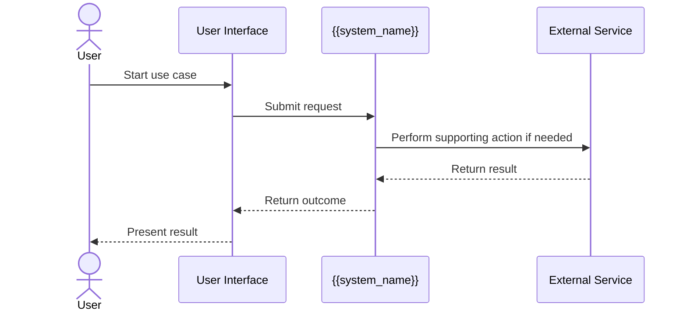
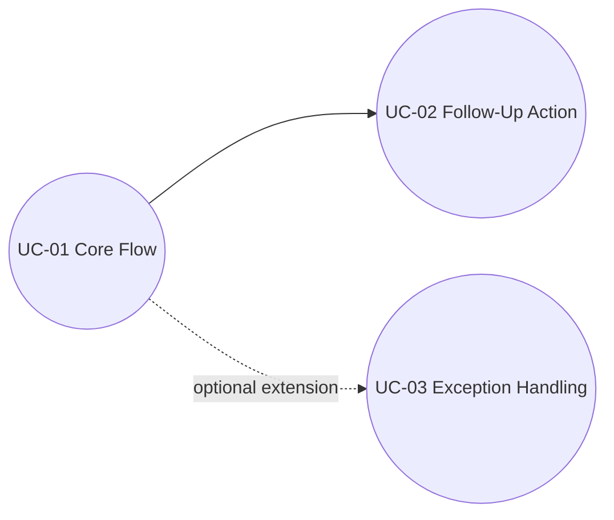

# Use Cases

> Describe how users and external actors interact with the system to achieve meaningful goals.
>
> Prefer Mermaid for diagrams. Mermaid has no native UML use-case syntax, so use flowcharts for system boundaries and sequence diagrams for interactions.

## Document Control

| Field | Value |
|---|---|
| System Name | {{system_name}} |
| Status | Draft / Reviewed / Approved |
| Version | {{document_version}} |
| Owner | {{owner_or_team}} |
| Last Updated | {{yyyy-mm-dd}} |
| Source of Truth | {{primary_spec_or_repo_path}} |
| Related Docs | {{system_components_doc}}, {{class_diagrams_doc}}, {{ui_ux_doc}}, {{adr_doc}} |

## 1. Purpose and Scope

**Purpose**  
{{What user goals this document explains and how it should be used.}}

**In Scope**
- {{workflow area or business capability}}
- {{workflow area or business capability}}

**Out of Scope**
- {{excluded workflow area}}
- {{excluded workflow area}}

## 2. Actor Catalog

| Actor | Type | Description | Goals | Notes |
|---|---|---|---|---|
| {{actor_name}} | Human / External System / Admin / Scheduler / Support | {{who or what this actor is}} | {{main goals}} | {{notes}} |
| {{actor_name}} | Human / External System / Admin / Scheduler / Support | {{who or what this actor is}} | {{main goals}} | {{notes}} |
| {{actor_name}} | Human / External System / Admin / Scheduler / Support | {{who or what this actor is}} | {{main goals}} | {{notes}} |

## 3. Use Case Inventory

| ID | Use Case Name | Primary Actor | Supporting Actors | Goal | Priority |
|---|---|---|---|---|---|
| UC-01 | {{use_case_name}} | {{primary_actor}} | {{supporting_actors}} | {{goal}} | High / Medium / Low |
| UC-02 | {{use_case_name}} | {{primary_actor}} | {{supporting_actors}} | {{goal}} | High / Medium / Low |
| UC-03 | {{use_case_name}} | {{primary_actor}} | {{supporting_actors}} | {{goal}} | High / Medium / Low |

## 4. System Boundary Diagram

```mermaid
flowchart LR
    User[Primary User]
    Admin[Administrator]
    External[External System]

    subgraph System[{{system_name}}]
        UC1((Submit Request))
        UC2((Review Status))
        UC3((Approve Change))
        UC4((Synchronize Data))
    end

    User --> UC1
    User --> UC2
    Admin --> UC3
    External --> UC4
    UC3 --> UC4
```

## 5. Actor Mapping

| Actor | Initiates | Participates In | Receives Outcome From | Notes |
|---|---|---|---|---|
| {{actor_name}} | {{use_cases}} | {{use_cases}} | {{use_cases}} | {{notes}} |
| {{actor_name}} | {{use_cases}} | {{use_cases}} | {{use_cases}} | {{notes}} |

## 6. Detailed Use Case Template

### {{use_case_id}} {{use_case_name}}

**Goal**  
{{What the actor is trying to achieve.}}

**Primary Actor**  
{{primary actor}}

**Supporting Actors**
- {{supporting actor}}
- {{supporting actor}}

**Trigger**  
{{What starts the use case.}}

**Preconditions**
- {{required state}}
- {{required state}}

**Success Post-Conditions**
- {{state or business outcome after success}}

**Main Success Scenario**
1. {{step in plain language}}
2. {{step in plain language}}
3. {{step in plain language}}
4. {{step in plain language}}
5. {{step in plain language}}

**Alternative Flows**
- {{alternate path and when it happens}}

**Exception Flows**
- {{failure condition and system response}}

**Business Rules**
- {{rule or policy}}

**Non-Functional Notes**
- {{usability, latency, reliability, security, accessibility, auditability}}



## 7. Relationships, Rules, and Traceability

### Use Case Relationships

| Related Use Cases | Relationship Type | Description |
|---|---|---|
| {{UC-01 and UC-02}} | Prerequisite / Extension / Reuse / Optional | {{how they relate}} |
| {{UC-02 and UC-03}} | Prerequisite / Extension / Reuse / Optional | {{how they relate}} |



### Cross-Cutting Rules

| Rule ID | Rule | Applies To | Notes |
|---|---|---|---|
| BR-01 | {{business rule}} | {{use cases}} | {{notes}} |
| BR-02 | {{business rule}} | {{use cases}} | {{notes}} |

### Requirement Traceability

| Use Case | Requirement / Story | Product Goal | Notes |
|---|---|---|---|
| {{use_case}} | {{requirement_id}} | {{goal}} | {{notes}} |
| {{use_case}} | {{requirement_id}} | {{goal}} | {{notes}} |

### Test Scenario Seeds

| Use Case | Scenario Type | Scenario Description |
|---|---|---|
| {{use_case}} | Happy Path | {{expected success behavior}} |
| {{use_case}} | Alternate Path | {{variation of normal flow}} |
| {{use_case}} | Exception Path | {{failure handling behavior}} |

## 8. UX, Questions, and Maintenance

**UX / Accessibility Notes**
- {{feedback, clarity, error recovery, discoverability, keyboard, screen reader, focus}}
- {{timing, permissions, copy, localization, comprehension}}

**Open Questions**
- {{unresolved question}}
- {{unresolved question}}

**Update This Document When**
- A new actor or workflow is introduced.
- Preconditions, outcomes, or exception paths change.
- Business rules or observable behavior changes.
