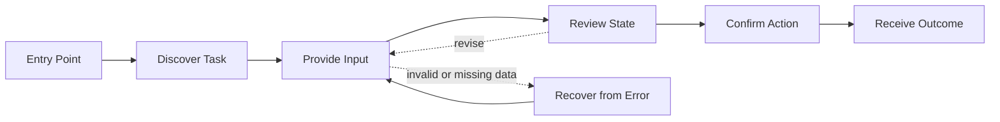
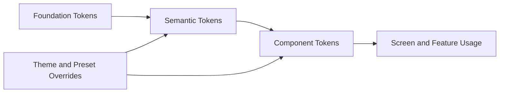

# User Interface / User Experience

> High-fidelity UI/UX specification for design and front-end handoff.
>
> Capture the experience vision, user flows, screen structure, token architecture, presets, states, motion, accessibility, and implementation constraints with enough detail that engineering does not need to guess.

## Document Control
| Field | Value |
|---|---|
| System Name | {{system_name}} |
| Status | Draft / Reviewed / Approved |
| Version | {{document_version}} |
| Owner | {{owner_or_team}} |
| Last Updated | {{yyyy-mm-dd}} |
| Source of Truth | {{primary_spec_or_repo_path}} |
| Related Docs | {{system_components_doc}}, {{use_cases_doc}}, {{class_diagrams_doc}}, {{adr_doc}} |

## 1. Purpose, Scope, and Inputs
**Purpose**  
{{What experience this document preserves, what fidelity is expected, and who should use it.}}

**In Scope**
- {{screen, workflow, product area, or feature family}}
- {{screen, workflow, product area, or feature family}}

**Out of Scope**
- {{excluded area}}
- {{excluded area}}

| Category | Input | Why It Matters | Status / Source |
|---|---|---|---|
| Product | Product summary | Defines what the UI must enable | {{status_or_link}} |
| Brand | Brand attributes and anti-references | Shapes tone, style, and differentiation | {{status_or_link}} |
| Visual | References, moodboards, existing assets | Reduces aesthetic ambiguity | {{status_or_link}} |
| Users | Primary users, goals, expertise | Aligns flows and density | {{status_or_link}} |
| Context | Devices, environment, localization | Determines responsive behavior | {{status_or_link}} |
| Accessibility | WCAG target, keyboard, screen reader needs | Preserves inclusive behavior | {{status_or_link}} |
| Technical | Front-end stack and system constraints | Keeps the spec implementable | {{status_or_link}} |
| Theming | Light/dark, density, presets, branding | Defines override strategy | {{status_or_link}} |

## 2. Experience Vision, Users, and Flows
| Attribute | Target Direction | Notes |
|---|---|---|
| Visual Tone | {{minimal, expressive, editorial, enterprise, tactical, playful}} | {{notes}} |
| Interaction Pace | {{instant, deliberate, guided, calm, energetic}} | {{notes}} |
| Information Density | {{sparse, balanced, dense}} | {{notes}} |
| Trust Signals | {{clarity, validation, auditability, stability, transparency}} | {{notes}} |
| Emphasis Strategy | {{contrast, hierarchy, motion, whitespace, shape}} | {{notes}} |
| Brand Differentiators | {{what makes the experience recognizable}} | {{notes}} |

**Design Principles**
- {{principle}}
- {{principle}}
- {{principle}}

| User Type | Goals | Expertise | Devices | Constraints |
|---|---|---|---|---|
| {{user_type}} | {{goals}} | {{expertise}} | {{devices}} | {{constraints}} |
| {{user_type}} | {{goals}} | {{expertise}} | {{devices}} | {{constraints}} |

| Flow ID | Flow Name | Primary User | Entry Point | Success Outcome | Priority |
|---|---|---|---|---|---|
| FLOW-01 | {{flow_name}} | {{user}} | {{entry_point}} | {{success_outcome}} | High / Medium / Low |
| FLOW-02 | {{flow_name}} | {{user}} | {{entry_point}} | {{success_outcome}} | High / Medium / Low |
| FLOW-03 | {{flow_name}} | {{user}} | {{entry_point}} | {{success_outcome}} | High / Medium / Low |



**Flow Template**
- Goal: {{what the user is trying to accomplish}}
- Entry Points: {{screen, CTA, link, deep link, notification, shortcut}}
- Preconditions: {{required state}}
- Success Criteria: {{observable outcome}}
- Failure / Friction Points: {{where users may get stuck}}
- Screens Involved: {{screen names}}
- Steps: 1. {{step}} 2. {{step}} 3. {{step}} 4. {{step}}

| Area | Entry Point | Primary Navigation | Secondary Navigation | Exit Paths | Notes |
|---|---|---|---|---|---|
| {{area_name}} | {{entry}} | {{primary_nav}} | {{secondary_nav}} | {{exit_paths}} | {{notes}} |
| {{area_name}} | {{entry}} | {{primary_nav}} | {{secondary_nav}} | {{exit_paths}} | {{notes}} |

## 3. Screens and Layout
| Screen / View | Type | Primary Goal | Primary Users | Responsive Variants | Status |
|---|---|---|---|---|---|
| {{screen_name}} | Page / Modal / Drawer / Panel / Widget | {{goal}} | {{users}} | {{desktop/tablet/mobile}} | Planned / Designed / Built |
| {{screen_name}} | Page / Modal / Drawer / Panel / Widget | {{goal}} | {{users}} | {{desktop/tablet/mobile}} | Planned / Designed / Built |
| {{screen_name}} | Page / Modal / Drawer / Panel / Widget | {{goal}} | {{users}} | {{desktop/tablet/mobile}} | Planned / Designed / Built |

| Screen Spec Field | Details |
|---|---|
| Screen Name | {{screen_name}} |
| Purpose | {{what this screen is for}} |
| Entry / Exit | {{entry points and exit paths}} |
| Primary / Secondary Actions | {{main and supporting actions}} |
| Content Hierarchy | {{highest to lowest priority content}} |
| Layout Zones | {{header, main, secondary panel, footer}} |
| Components Used | {{core components}} |
| Data Dependencies | {{required and optional data}} |
| States | Default, Loading, Empty, Error, Success, Restricted |
| Responsive Notes | {{layout and priority changes by breakpoint}} |
| Accessibility Notes | {{focus order, labels, landmarks, keyboard behavior}} |
| Visual References | {{mockup, prototype, screenshot, moodboard}} |

| Layout Topic | Value / Rule | Usage |
|---|---|---|
| Breakpoints | {{xs/sm/md/lg/xl}} | {{device strategy}} |
| Grid | {{columns and max widths}} | {{page and panel layout}} |
| Gutter | {{value}} | {{spacing between columns}} |
| Spacing Scale | {{token scale}} | {{internal and section spacing}} |
| Density Modes | {{comfortable / compact / spacious}} | {{where each applies}} |

## 4. Design Language, Tokens, and Presets
| Dimension | Direction | Notes |
|---|---|---|
| Shape Language | {{rounded, sharp, geometric, soft, industrial}} | {{notes}} |
| Surface Style | {{flat, layered, glassy, tactile, textured}} | {{notes}} |
| Icon / Illustration Style | {{outlined, filled, technical, editorial, custom}} | {{notes}} |
| Typography Personality | {{neutral, expressive, technical, editorial}} | {{notes}} |
| Color Strategy | {{muted, bold, brand-led, utility-led}} | {{notes}} |
| Data Visualization Style | {{dashboard, analytical, expressive}} | {{notes}} |

**Token Layers**
- Foundation tokens: raw values for color, type, spacing, radius, border, shadow, z-index, and motion.
- Semantic tokens: aliases such as `text.primary`, `surface.raised`, and `action.primary.bg`.
- Component tokens: component-scoped values such as `button.padding.x` and `input.border.focus`.
- Presets: light/dark, density, reduced motion, brand variants, or tenant overrides.



| Layer / Preset | Examples | Notes |
|---|---|---|
| Foundation | {{color.brand.500}}, {{space.100}}, {{font.size.200}}, {{radius.sm}}, {{motion.duration.base}} | {{raw values only}} |
| Semantic | {{text.primary}}, {{surface.canvas}}, {{border.default}}, {{status.success.fg}} | {{meaning-first aliases}} |
| Component | {{button.bg.primary}}, {{card.surface}}, {{input.border.focus}} | {{scoped overrides}} |
| Presets | {{light}}, {{dark}}, {{compact}}, {{brand_variant}}, {{reduced_motion}} | {{override strategy}} |

**Token Governance**
- {{when foundation tokens may be used directly}}
- {{when semantic tokens are required}}
- {{when to introduce component tokens or presets}}

## 5. Components, States, and Motion
| Component | Purpose | Variants | Required States | Token Dependencies | Notes |
|---|---|---|---|---|---|
| {{Button}} | {{purpose}} | {{variants}} | {{states}} | {{tokens}} | {{notes}} |
| {{Input}} | {{purpose}} | {{variants}} | {{states}} | {{tokens}} | {{notes}} |
| {{Card}} | {{purpose}} | {{variants}} | {{states}} | {{tokens}} | {{notes}} |
| {{Modal}} | {{purpose}} | {{variants}} | {{states}} | {{tokens}} | {{notes}} |

**Component Template**
- Name: {{component_name}}
- Anatomy: {{part_name: purpose}}
- Variants: {{variants}}
- States: Default, Hover, Focus, Active, Disabled, Loading, Error, Success
- Behavior Rules: {{interaction rules}}
- Accessibility Rules: {{keyboard, semantics, announcements}}

```mermaid
stateDiagram-v2
    [*] --> Default
    Default --> Hover
    Hover --> Focus
    Focus --> Active
    Default --> Loading
    Loading --> Success
    Loading --> Error
    Default --> Disabled
```

| Motion Item | Use Case or Trigger | Timing / Easing | Notes |
|---|---|---|---|
| {{instant}} | {{use_case}} | {{duration / easing}} | {{notes}} |
| {{standard}} | {{use_case}} | {{duration / easing}} | {{notes}} |
| {{emphasized}} | {{use_case}} | {{duration / easing}} | {{notes}} |
| {{page_transition}} | {{trigger}} | {{timing / preset}} | {{notes}} |
| {{modal_enter}} | {{trigger}} | {{timing / preset}} | {{notes}} |
| {{list_stagger}} | {{trigger}} | {{timing / preset}} | {{notes}} |

**Reduced Motion Behavior**
- {{what is removed, shortened, or replaced}}
- {{how state changes remain understandable without full animation}}

## 6. Feedback, Accessibility, Handoff, and Maintenance
| State Type | Trigger | Visual Treatment | Messaging Guidance | Recovery Path |
|---|---|---|---|---|
| Loading | {{trigger}} | {{visual treatment}} | {{copy guidance}} | {{recovery}} |
| Empty | {{trigger}} | {{visual treatment}} | {{copy guidance}} | {{recovery}} |
| Error | {{trigger}} | {{visual treatment}} | {{copy guidance}} | {{recovery}} |
| Success | {{trigger}} | {{visual treatment}} | {{copy guidance}} | {{recovery}} |
| Restricted | {{trigger}} | {{visual treatment}} | {{copy guidance}} | {{recovery}} |

| Accessibility Area | Requirement | Notes |
|---|---|---|
| Keyboard Navigation | {{requirement}} | {{notes}} |
| Focus Visibility | {{requirement}} | {{notes}} |
| Screen Reader Semantics | {{requirement}} | {{notes}} |
| Contrast | {{requirement}} | {{notes}} |
| Motion Sensitivity | {{requirement}} | {{notes}} |
| Touch Targets / Mobile | {{requirement}} | {{notes}} |
| Localization / RTL | {{requirement}} | {{notes}} |

| Artifact | Location | Notes |
|---|---|---|
| Design Source / Prototype | {{link}} | {{notes}} |
| Token Export / Theme Spec | {{link}} | {{notes}} |
| Asset Library | {{link}} | {{notes}} |
| Motion Reference | {{link}} | {{notes}} |

**Validation Checklist**
- Layout, typography, and tokens match the documented design language.
- Presets and theme overrides work consistently.
- Core states, feedback states, and reduced motion are implemented.
- Responsive behavior preserves hierarchy and task clarity.
- Accessibility requirements are met without degrading the flow.

**Open Questions**
- {{unresolved question}}
- {{unresolved question}}

**Update This Document When**
- A major flow, screen, design principle, preset, or token rule changes.
- A new visible component or motion pattern is introduced.
- Accessibility or platform constraints materially change the UI.