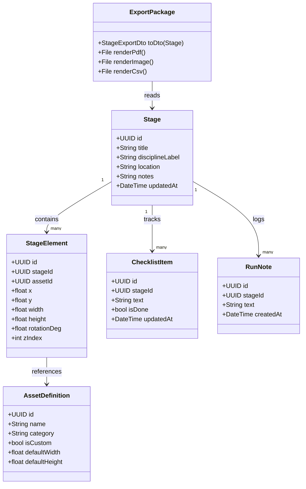
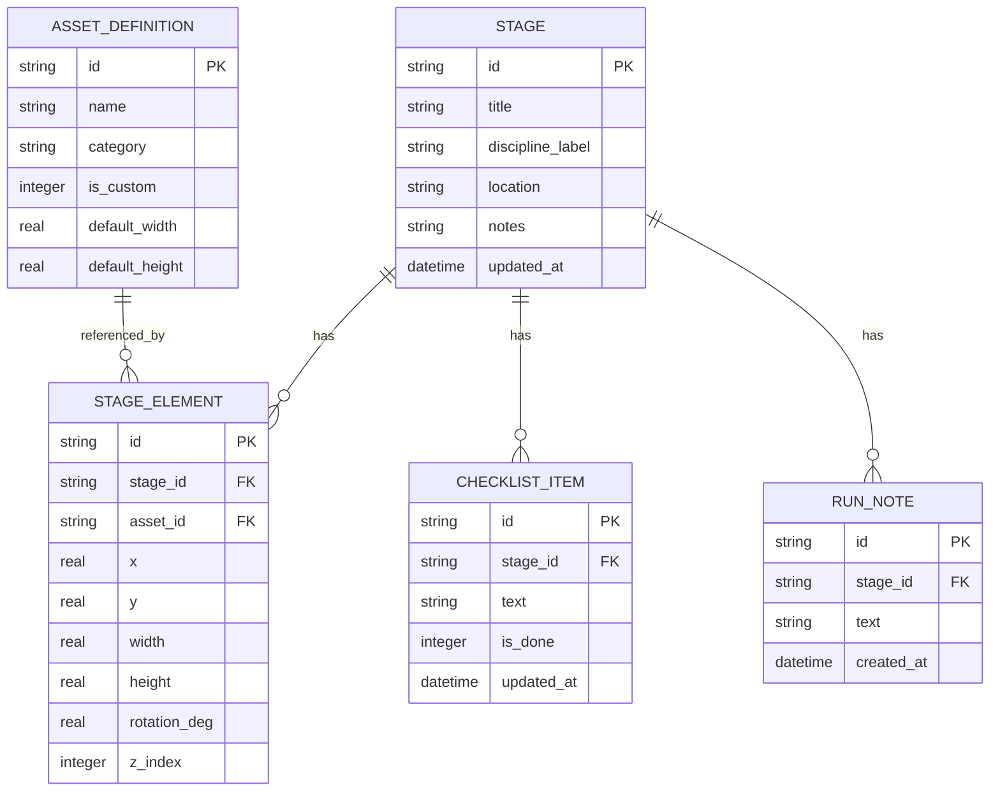

# Class Diagrams

## Document Control

| Field | Value |
|---|---|
| System Name | Shooting Stage Designer (iOS v1) |
| Status | Draft |
| Version | 0.1.0 |
| Owner | Architecture |
| Last Updated | 2026-05-09 |
| Source of Truth | docs/specs/ios-stage-designer-v1.md |
| Related Docs | docs/architecture/system-components.md, docs/architecture/use-cases.md, docs/contracts/stage-export-schema.v1.json |

## 1. Purpose and Scope

Purpose: define static domain and persistence model for iOS v1 with Android portability.

In Scope:
- Core domain entities and value objects.
- Repository interfaces and export DTOs.
- SQLite entity relationships.

Out of Scope:
- Network DTOs and remote API contracts.
- Rules engine scoring abstractions.

## 2. Structural Summary

| Topic | Summary |
|---|---|
| Primary Modules | Editor, Assets, Notes, Export, Persistence |
| Core Abstractions | Stage, StageElement, AssetDefinition, RunNote, ChecklistItem |
| Dominant Patterns | Layered architecture, repository pattern, command-based editing |

## 3. High-Level Class Diagram

## 4. Repository Contracts

| Type | Responsibility |
|---|---|
| StageRepository | CRUD for Stage and StageElement aggregates |
| AssetRepository | Built-in/custom asset retrieval and storage |
| NotesRepository | Checklist and run note persistence |
| ExportRepository | Optional record of generated export metadata |

## 5. ER Diagram

## 6. Invariants

- Stage element dimensions must be positive values.
- zIndex values are unique per stage at persistence boundary.
- StageElement references must point to a valid AssetDefinition.
- Export DTO represents one immutable snapshot of Stage aggregate.
