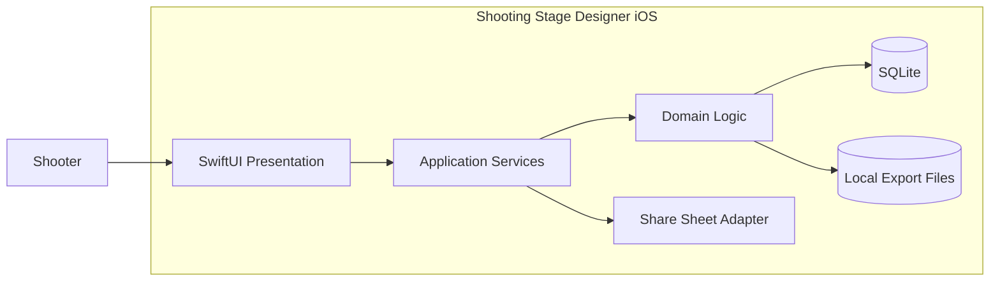
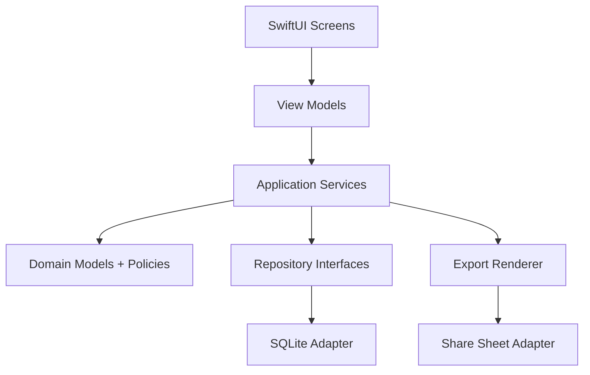

# System Components

## Document Control

| Field | Value |
|---|---|
| System Name | Shooting Stage Designer (iOS v1) |
| Status | Draft |
| Version | 0.1.0 |
| Owner | Architecture |
| Last Updated | 2026-05-09 |
| Source of Truth | docs/specs/ios-stage-designer-v1.md |
| Related Docs | docs/architecture/use-cases.md, docs/architecture/class-diagrams.md, docs/architecture/user-interface.md |

## 1. Purpose and Scope

Purpose: define implementation architecture for iPhone-first v1.

In Scope:
- Local iOS application runtime.
- Stage editing, asset catalog, notes, export/share.

Out of Scope:
- Remote APIs and cloud services.
- Rules engine and import pipeline.

## 2. Architecture Summary

| Topic | Summary |
|---|---|
| Architectural Style | Layered modular app |
| Primary Actors | Shooter, range organizer |
| Entry Points | iOS app screens |
| Primary Stores | SQLite database, local file artifacts |
| Key Integrations | iOS Share Sheet, PDF/image export APIs |
| Critical Flows | Stage editing, asset placement, export |

## 3. System Context

Context Notes:
- Single-device trust boundary.
- No external network dependency in v1.

## 4. Component Inventory

| Component | Type | Responsibility | Inputs | Outputs | Depends On |
|---|---|---|---|---|---|
| Stage Editor UI | UI | Render and edit stage canvas | Gestures, commands | UI state changes | Editor service |
| Stage Application Service | Service | Orchestrate stage use cases | UI intents | Domain commands/results | Repositories |
| Asset Catalog Service | Service | Resolve built-in and custom assets | Filters, queries | Asset lists, selections | Asset repository |
| Notes Service | Service | Manage checklist and run notes | Note/checklist actions | Ordered notes/checks | Stage repository |
| Export Service | Service | Produce PDF, image, CSV artifacts | Stage snapshot + metadata | Files + share payload | File system adapters |
| Persistence Layer | Store | Save and load domain entities | Repository operations | Entities/data rows | SQLite |

## 5. Internal Component Diagram

## 6. Data and Runtime View

### Data Ownership

| Data Domain | System of Record | Producer | Consumers | Notes |
|---|---|---|---|---|
| Stages | SQLite | Stage service | Editor, exports | Local-only |
| Asset catalog | SQLite + seed files | Asset service | Editor | Built-in + custom |
| Notes/checklist | SQLite | Notes service | Stage detail + exports | Time-ordered |
| Export artifacts | Local files | Export service | Share flow | Ephemeral or user-retained |

### Runtime

| Component | Runtime | Deployable Unit | Environment(s) | Notes |
|---|---|---|---|---|
| iOS app | iOS process | Xcode app target | local/test/release | iPhone-first |
| SQLite adapter | iOS process | App module | local/test/release | On-device storage |
| Export renderer | iOS process | App module | local/test/release | PDF/image/CSV generation |

## 7. Cross-Cutting Concerns

| Concern | Notes |
|---|---|
| Authentication/Authorization | None in v1 |
| Observability | Local logs and debug diagnostics |
| Configuration/Secrets | No runtime secrets required for v1 |
| Reliability | Autosave, crash-safe writes, migration rollback guard |
| Performance | Maintain responsive canvas interactions |
| Security/Compliance | Local-only user data |

## 8. Risks and Tradeoffs

- Canvas complexity can cause performance regressions if object counts grow.
- Export rendering fidelity may vary by device class.
- Local-only data means user must manage backup externally in v1.
