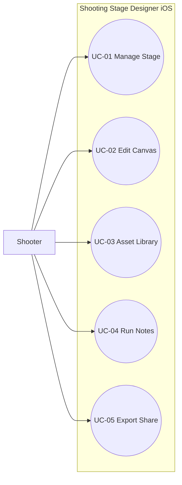

# Use Cases

## Document Control

| Field | Value |
|---|---|
| System Name | Shooting Stage Designer (iOS v1) |
| Status | Draft |
| Version | 0.1.0 |
| Owner | Product + Architecture |
| Last Updated | 2026-05-09 |
| Source of Truth | docs/specs/ios-stage-designer-v1.md |
| Related Docs | docs/architecture/system-components.md, docs/architecture/class-diagrams.md, docs/architecture/user-interface.md |

## 1. Purpose and Scope

Purpose: specify user goals and flows for iPhone-first v1 delivery.

In Scope:
- Stage lifecycle and canvas editing.
- Asset management and placement.
- Checklist/run notes.
- Export-only sharing.

Out of Scope:
- Import workflows.
- Rules-based scoring/validation.
- Cloud synchronization and multi-user collaboration.

## 2. Actor Catalog

| Actor | Type | Description | Goals | Notes |
|---|---|---|---|---|
| Shooter | Human | Primary end-user | Build and iterate stage layouts | iPhone-first UX |
| Range Organizer | Human | Secondary user | Prepare stage plans and share exports | Uses same flows as shooter |

## 3. Use Case Inventory

| ID | Use Case Name | Primary Actor | Goal | Priority |
|---|---|---|---|---|
| UC-01 | Create and Manage Stage | Shooter | Create, edit, organize stage files | High |
| UC-02 | Edit Stage Canvas | Shooter | Place and manipulate stage objects | High |
| UC-03 | Manage Asset Library | Shooter | Use built-in and custom assets | High |
| UC-04 | Record Run Notes | Shooter | Capture checklist and notes | Medium |
| UC-05 | Export and Share Stage | Shooter | Generate PDF/image/CSV and share | High |

## 4. System Boundary Diagram

## 5. Detailed Use Cases

### UC-01 Create and Manage Stage

Goal: maintain stage records locally.

Main Scenario:
1. User opens stage list.
2. User creates a new stage with title.
3. User edits stage metadata.
4. System auto-saves changes.
5. User returns to list and sees updated stage.

Alternative Flows:
- Duplicate existing stage to start from template.
- Archive stage instead of deleting.

### UC-02 Edit Stage Canvas

Goal: produce visual stage layout.

Main Scenario:
1. User opens stage editor.
2. User selects asset and places on canvas.
3. User moves/rotates/resizes object.
4. User reorders object layer.
5. User uses undo/redo as needed.

Exception Flows:
- Invalid transform is rejected and prior state retained.

### UC-03 Manage Asset Library

Goal: quickly find and use stage assets.

Main Scenario:
1. User opens asset panel.
2. User filters by category or search term.
3. User selects built-in asset or creates custom one.
4. User inserts asset onto canvas.

### UC-04 Record Run Notes

Goal: track setup and run-through checks.

Main Scenario:
1. User opens notes tab.
2. User adds checklist items.
3. User marks items complete.
4. User appends run note entries.

### UC-05 Export and Share Stage

Goal: create external artifacts from stage data.

Main Scenario:
1. User chooses export format (PDF, PNG/JPEG, CSV).
2. System renders export artifact.
3. User reviews preview.
4. User opens share sheet and shares/saves output.

Exception Flows:
- Export failure surfaces actionable error and preserves source stage.

## 6. Cross-Cutting Rules

| Rule ID | Rule | Applies To |
|---|---|---|
| BR-01 | Export-only in v1; import is unavailable | UC-05 |
| BR-02 | All stage changes persist locally | UC-01, UC-02, UC-03, UC-04 |
| BR-03 | Rules engine is not part of v1 behavior | UC-02, UC-04 |

## 7. Test Scenario Seeds

| Use Case | Scenario Type | Scenario Description |
|---|---|---|
| UC-01 | Happy Path | Create, edit, close app, reopen, verify persistence |
| UC-02 | Happy Path | Place 50 objects and use transform actions |
| UC-03 | Alternate | Create custom asset and reuse after restart |
| UC-05 | Exception | Export failure presents error without data loss |
